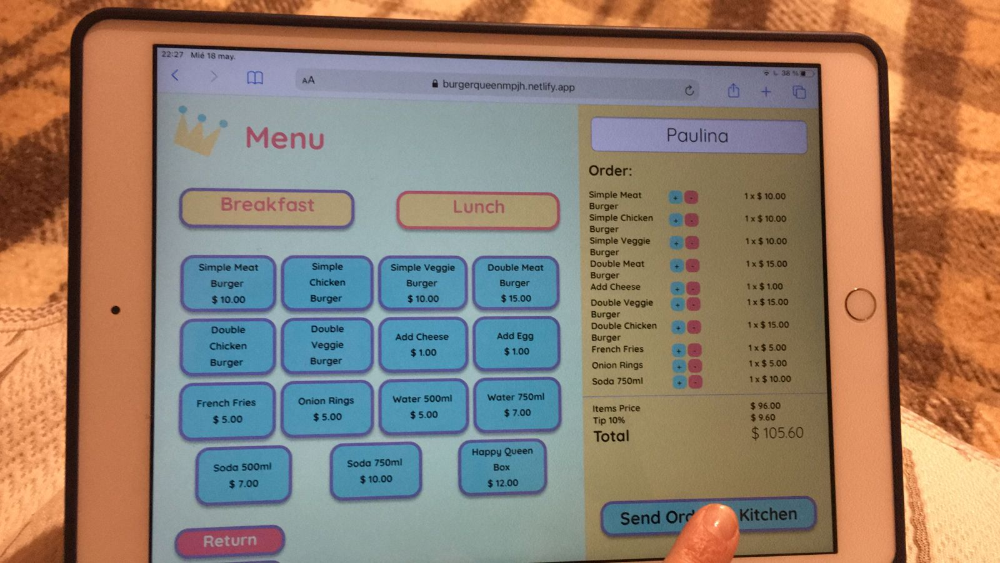
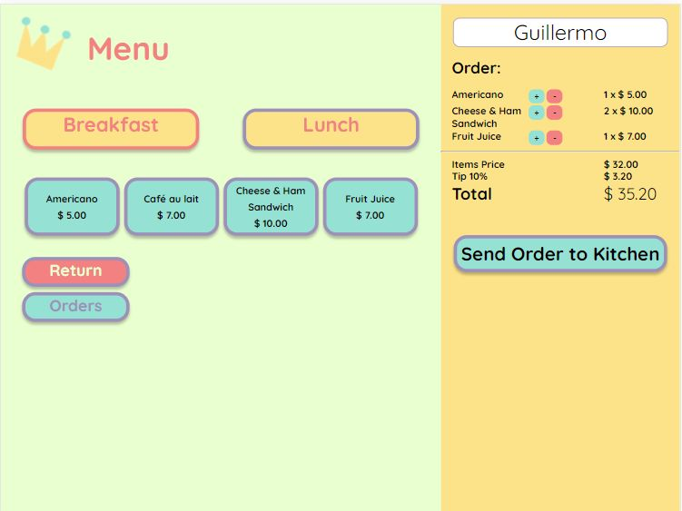

## Índice:

  - [1. Presentación del proyecto](#1-presentación-del-proyecto)
  - [2. Interfaz de la Aplicación](#2-interfaz-de-la-aplicación)
  - [3. Prototipo de Alta Fidelidad](#3-prototipo-de-alta-fidelidad)
  - [4. Historias de Usuario](#4-historias-de-usuario)

<!--  -->
## BIENVENID@S AL RESTAURANT BURGER QUEEN

Burger Queen es un restaurant de hamburguesas familiar. Acá son bienvenidos niños, ancianos, jóvenes y adultos. También puedes traer a tu mascota, porque somos Pet Friendly!

Para hacer un pedido en Burger Queen, sólo acércate a uno de los meseros ¡y en un santiamén estarás disfrutando de las mejores hamburguesas de la ciudad!
¡Visítanos a culquier hora, porque Burger Queen atiende las 24 horas!

Nuestro horario:

 * _Desayuno_: Disponible de 5:00 a 11:00
 * _Almuerzo_: Disponible de 11:00 a 5:00.

### Pero... ¿Qué es la aplicación Burger Queen?

### 1. Presentación del proyecto

 Burger Queen es una interfaz para poder organizar los pedidos del restaurant entre los meseros y la cocina

### 2. Interfaz de la Aplicación

La aplicación está diseñada para ser usada en una tablet en modo horizontaltal como se puede ver en el mockup y en las fotografías de una tablet con la aplicación funcional.

Al ingresar a nuestra aplicación, se puede escoger entre "Mesero" y "Cocina" (waiter y kitchen).

Al ingresar a la vista de "waiter"(mesero), se desplegará la vista de mesero, que tiene dos tipos de menú: **_desayuno_** y **_almuerzo_** que corresponden a los horarios establecidos por el restaurant.

Al seleccionar _breakfast_(desayuno), tenemos las opciones del mismo. En ella podemos elegir y hacer click elementos para agregarlos al carrito. También podemos aumentar o disminuir su cantidad dando click a los símbolos de + y - que están en el carrito.
Podemos agregar un nombre al cliente, para poder identificarlo al momento de entregar su pedido.
Al hacer click en "Send order to Kitchen", el pedido se envía a cocina.

También existe el botón "Return", que nos lleva a la vista de inicio, y el botón "Orders" que nos lleva a la vista de pedidos.

Al seleccionar "Lunch" (almuerzo) podemos ver las opciones de platos, agregados y bebestibles disponibles. Esta página funciona igual que la anterior. Cuando el carrito no tiene elementos, muestra el texto "Cart is empty" (El carrito está vacío).

Desde la vista _Kitchen_, podemos ver los pedidos en orden. el último pedido siempre se verá de los primeros.

El chef prepara el pedido y puede cambiar su estado a _"ready"_ haciéndole click al botón.

El mesero por su parte puede ver los pedidos listos para servir. Al darle click al botón puede marcar el pedido como entregado.

Por último, si el usuario ingresa una dirección incorrecta en la barra de direcciones, la aplicación lo llevará a una página de error 404.

### 3. Prototipo de Alta Fidelidad

Se eligió una paleta de colores y un estilo de fuente que evocaran lo que es un restaurant familiar. 

Se creó un prototipo de alta fidelidad en Figma:

### 4. Historias de Usuario

#### Historia de Usuario 1
**_Mesero/a debe poder tomar pedido de cliente_**
_"Yo como meserx quiero tomar el pedido de un cliente para no depender de mi mala memoria, para saber cuánto cobrar, y enviarlo a la cocina para evitar errores y que se puedan ir preparando en orden."_

**Criterios de aceptación:**

* Anotar nombre de cliente.
* Agregar productos al pedido.
* Eliminar productos.
* Ver resumen y el total de la compra.
* Enviar pedido a cocina (guardar en alguna base de datos).
* Se ve y funciona bien en una tablet

#### Historia de Usuario 2

**_Jefe de cocina debe ver los pedidos_**

_"Yo como jefx de cocina quiero ver los pedidos de los clientes en orden y marcar cuáles están listos para saber qué se debe cocinar y avisar a lxs meserxs que un pedido está listo para servirlo a un cliente."_

**Criterios de Aceptación:**

* Ver los pedidos ordenados según se van haciendo.
* Marcar los pedidos que se han preparado y están listos para servirse.

#### Historia de Usuario 3

**_Meserx debe ver pedidos listos para servir_**

_"Yo como meserx quiero ver los pedidos que están preparados para entregarlos rápidamente a los clientes que las hicieron._

**Criterios de Aceptación:**

* Ver listado de pedido listos para servir.
* Marcar pedidos que han sido entregados.

### 5. ¡Prueba Burger Queen!

Puedes utilizar la app visitando este [Link](https://burgerqueenmpjh.netlify.app/)
**¡Buen provecho!**

<!-- 

## WELCOME TO BURGER QUEEN RESTAURANT -->